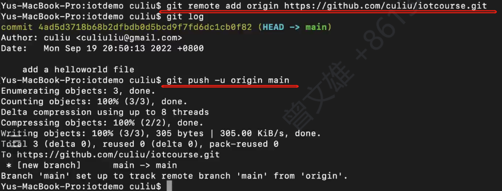
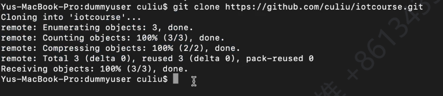

### Git 版本管理

#### 1、git init

        git仓库初始化

        .git非常重要，存放记录

    

#### 2、git log

        查看git提交日志

    

#### 3、git status

        查看git是否处于提交缓冲状态

    

#### 4、git add  <file>

        将文件提交到缓冲区

    

#### 5、git commit -m "<提交附带的提示标题信息>"

        给提交操作赋予名称

    

#### 6、git branch -M <分支名称>

        给git操作建立新分支，并赋予名称

    

#### 7、git remote add origin   <url>

        添加远程仓库

    　　要添加一个新的远程仓库,可以指定一个简单的名字,以便将来引用,运行

```git命令
git remote add [shortname] [url]
```

    

#### 8、git push -u [shortname] [url]

        提交至远程仓库



    

#### 9、git clone <url>

        从远程仓库克隆项目下来



    

#### 10、git pull

    

#### 11、git checkout <commit ID>

        到达某个版本号

    

#### 12、git branch

课程网站会有笔记

下次课9A314
